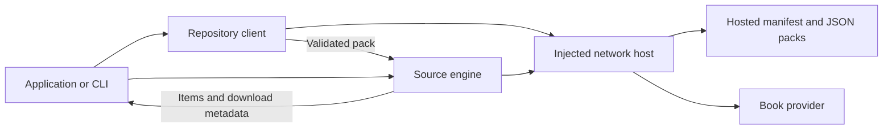

# Integrate the package

Use the same interpreter in any compatible JavaScript runtime. The application
supplies networking and presentation; source definitions live in an independent
HTTP(S) repository. Install the package using the [README](../README.md) before
using these imports. The package includes TypeScript declarations for its public
exports; source-specific result fields have type `unknown` because the engine
preserves their extracted values.

## Runtime architecture

The following diagram shows runtime data flow. It omits application storage,
rendering, authentication, and download management.



The repository client fetches source data through the host and validates it. The
engine interprets a selected pack, sends provider requests through the same host,
and returns items or download metadata. The application decides when to fetch a
cover, download a book, update the UI, or persist data.

| Module | Runtime responsibility |
| --- | --- |
| `book-sources` | `runSearch`, `runResolve`, and `interpolate`; no platform imports. |
| `book-sources/repository` | `createRepository`; hosted manifest loading, validation, and in-memory caching. |
| `book-sources/fetch-host` | `createFetchHost`; adapt a Fetch-compatible function to the text host contract. |
| `book-sources/validation` | `validateSource`; check parsed JSON without network requests. |
| `book-sources/node-host` | `createNodeHost`; Node fetch defaults used by the CLI. |

The engine needs modern JavaScript features such as `String.matchAll`, generators,
`Object.fromEntries`, promises, and `setTimeout` for retry delays. The repository
client also needs `URL`, `Map`, and `Set`. Transpile or supply runtime polyfills as
needed. The portable imports do not use Node APIs, `Buffer`, the DOM, or UI globals.

## Load a hosted source

The following function accepts a manifest URL and your runtime's fetch function.
It returns results from one source. Reuse the repository instance across calls in
your application to retain its cache.

```javascript
import { runSearch } from 'book-sources';
import { createRepository } from 'book-sources/repository';
import { createFetchHost } from 'book-sources/fetch-host';

export function createCatalog(manifestURL, fetchRequest) {
  const host = createFetchHost(fetchRequest);
  const repository = createRepository(manifestURL, host);

  async function search(sourceId, query, page = 1) {
    const source = await repository.load(sourceId);
    return runSearch(source, query, page, host);
  }

  return { repository, host, search };
}
```

In a runtime with global `fetch`, pass `(url, options) => fetch(url, options)`.
A wrapper preserves any runtime-specific function binding. `repository.list()`
returns manifest entries without fetching every pack. `repository.load(id)`
fetches and validates a pack on demand. Concurrent loads of the same pack share
one pending request. Rejected loads can retry. `repository.refresh()` reloads the
manifest and clears cached packs after a successful refresh.

Cached packs are shared objects; treat them as read-only. There is no automatic
refresh, persistent cache, or cross-repository search. An application can create
multiple repository clients and choose its own search concurrency and result
aggregation policy.

## Implement the host contract

You can bypass the Fetch adapter and implement one method over a native bridge,
a test fixture, or your existing network client. The contract is shown below;
these TypeScript types describe the interface.

```typescript
type RequestOptions = {
  method?: string;
  headers?: Record<string, string>;
};

type TextResponse = {
  status: number;
  headers: Record<string, string>;
  body: string;
};

type SourceHost = {
  request(url: string, options?: RequestOptions): Promise<TextResponse>;
};
```

Return HTTP error responses with their status so the engine can apply its retry
policy. Reject the promise for transport failures; the engine propagates them
without retrying. `createFetchHost` converts `response.text()` to `body` and
accepts response headers as a plain object or an object with `forEach`.

The host controls credentials, cookies, redirects, URL permissions, timeouts,
and response-size limits. Request headers in source steps are literal strings.
If a provider needs app-managed authentication, inject it in the host rather than
publishing credentials in a JSON pack. Browser integrations remain subject to
provider CORS rules; a Fetch adapter does not bypass them.

## Resolve downloads and display covers

Pass an item from `runSearch` to `runResolve` with the same source and host.
This function returns metadata and does not fetch the book's bytes.

```javascript
import { runResolve } from 'book-sources';

export async function describeBook(source, item, host) {
  const download = await runResolve(source, item, host);
  return {
    downloadURL: download.url,
    suggestedFileName: download.fileName,
    downloadHeaders: download.headers,
    coverURL: item.coverUrl || null,
  };
}
```

Your application downloads the book and saves it through its own file APIs. Use
`coverUrl` with your platform's image loader, or fetch it through your application's
binary transport. A search only retrieves the cover URL; it does not download all
images. Show a placeholder when the URL is missing or loading fails. The source
format currently has no separate cover headers or cover-resolution pipeline.

## Use the package in Lynx

Run repository loading and engine calls on the background thread. Pass Lynx's
global `fetch` to `createFetchHost`.
Lynx networking depends on the host application's HTTP service. Check the
[official Lynx networking guide](https://lynxjs.org/guide/interaction/networking.html)
and [background-thread API guidance](https://github.com/lynx-family/lynx-website/blob/main/docs/public/AGENTS.md)
for your runtime.

Keep the CLI and Node host out of the device bundle. Verify the JavaScript
features listed above against your bundler and target runtime, then test source
loading, search, retries, image display, and native file downloads on a device.
The repository contains no Lynx UI or device test harness; Node tests verify the
host contract and parser behavior, not device compatibility.

## Extend the implementation

Keep transformations in named functions with a single purpose. The engine reads
as request steps, segment extraction, field extraction, required-field checks,
and output. Operations reduce a value from left to right. Field extraction stays
ordered because later templates can reference earlier fields.

Use sequential `await` for dependent steps and retries. Do not replace these with
an async `forEach` or parallel requests. Result extraction stops when the accepted
item limit is reached. These conventions provide the vertical readability of a
composed pipeline without adding a reactive-stream dependency.

Add a source through JSON when the existing vocabulary supports it. For a new
operation, update the interpreter, validator, format reference, and behavior tests
together. Keep platform APIs in adapters and retain the documented ordering and
error behavior.
